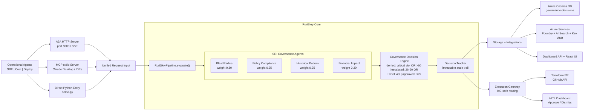

# 🛡️ RuriSkry — AI Action Governance & Simulation Engine

> **Because autonomous AI needs accountable AI.**

[](LICENSE)
[](https://www.python.org/downloads/)
[](https://azure.microsoft.com)
[](https://microsoft.com)

RuriSkry intercepts, simulates, and scores every AI agent action **before** it touches your infrastructure. It sits between operational AI agents (Monitoring bots, cost optimizers, deployment agents) and Azure cloud resources, acting as a production-grade supervisory intelligence layer.

Born at the Microsoft AI Dev Days Hackathon 2026, RuriSkry has evolved into a fully async, enterprise-ready governance engine with live Azure topology analysis, durable audit trails (Cosmos DB), Microsoft Teams alerting, explainable AI verdicts with counterfactual analysis, and 777+ automated tests.

---

## The Problem

AI agents are increasingly managing cloud infrastructure autonomously — scaling clusters, restarting services, deleting idle resources, modifying network rules. But capability without accountability is dangerous:

- A **cost optimization agent** deletes a disaster recovery VM to save $800/month — not knowing it just compromised a compliance requirement
- An **SRE agent** restarts a payment service — unaware that identical restarts caused cascade failures three times before
- A **deployment agent** opens a network port — accidentally exposing internal admin dashboards to the public internet

Today's tooling offers two options: **block actions with static rules** or **monitor after execution**. Nobody simulates outcomes before allowing an agent to act.

## The Solution

RuriSkry is the missing governance layer. Before any agent action executes, it runs through four specialized simulation agents that produce a branded **Skry Risk Index (SRI™)**:

```
┌─────────────────────────────────────────────────────┐
│              SKRY RISK INDEX (SRI™)              │
│                                                     │
│   SRI:Infrastructure ████████████░░░░░░░░  32/100   │
│   SRI:Policy         ████████████████░░░░  40/100   │
│   SRI:Historical     ██████░░░░░░░░░░░░░░  15/100   │
│   SRI:Cost           ████░░░░░░░░░░░░░░░░  10/100   │
│                                          ─────────  │
│   SRI Composite                           72/100    │
│                                                     │
│   Verdict: ❌ DENIED                                │
│   Reason: Critical policy violation + high blast    │
│           radius on production dependency chain     │
└─────────────────────────────────────────────────────┘
```

### SRI™ Dimensions

| Dimension | What It Measures | Agent |
|-----------|-----------------|-------|
| **SRI:Infrastructure** | Blast radius — downstream resources and services affected | Blast Radius Simulation Agent |
| **SRI:Policy** | Governance compliance — policy violations and severity | Policy & Compliance Agent |
| **SRI:Historical** | Precedent risk — similarity to past incidents | Historical Pattern Agent |
| **SRI:Cost** | Financial volatility — projected cost change and over-optimization | Financial Impact Agent |

### Decision Thresholds

- **SRI ≤ 25** → ✅ Auto-Approve — low risk, execute immediately
- **SRI 26–60** → ⚠️ Escalate — moderate risk, human review required
- **SRI > 60** → ❌ Deny — high risk, action blocked with explanation
- **Any non-overridden HIGH policy violation** → ⚠️ Escalate floor — prevents score dilution where low blast radius / cost dims push composite below 25 despite a HIGH policy flag
- **Critical policy violation** → ❌ Deny — unless the LLM governance agent determined it doesn't truly apply (e.g. remediation intent)

---

## Architecture



---

## Technology Stack

| Component | Technology | Purpose |
|-----------|-----------|---------|
| Agent-to-Agent Protocol | A2A SDK (`a2a-sdk`) + `agent-framework-a2a` | Network protocol for agent discovery and task streaming |
| Agent Orchestration | Microsoft Agent Framework (`agent-framework-core`) | Multi-agent coordination + gpt-5-mini tool calls |
| Model Intelligence | Azure OpenAI Foundry — gpt-5-mini | LLM reasoning for each governance agent |
| MCP Interception | FastMCP stdio server | Intercept actions from Claude Desktop / MCP hosts |
| Infrastructure Graph | Azure Resource Graph + Azure Retail Prices API | Real-time dependency topology (KQL + tags) and SKU cost data |
| Incident Search | Azure AI Search (BM25) | Historical incident similarity |
| Audit DB | Azure Cosmos DB (SQL API) | Governance decisions + agent registry + scan-run records |
| Secret Management | Azure Key Vault + `DefaultAzureCredential` | Runtime secret resolution |
| Dashboard | React + Vite + FastAPI | Governance visualization + REST API — 5-page "Ops Nerve Center" app: DM Sans UI + JetBrains Mono data fonts, CSS design token system, dot-grid background, teal breathing logo glow, amber urgency pulse on HITL reviews, NumberTicker count-up metrics, GlowCard glass panels, gradient SRI chart, animated VerdictBadges |
| Teams Notifications | Microsoft Teams Incoming Webhook (Adaptive Cards) | Real-time alerts for DENIED/ESCALATED verdicts |
| Azure Monitor → RuriSkry | `azurerm_monitor_action_group.ruriskry` (`terraform-core`) | CPU/heartbeat/custom alerts POST to `/api/alert-trigger` → async investigation via `MonitoringAgent` → governance verdict → Alerts tab |
| Decision Explanation Engine | `DecisionExplainer` — LLM summary + counterfactual analysis | Click any verdict row → 6-section drilldown with "what would change this?" analysis |

---

## Key Features

### Intelligent Governance — LLM as Decision Maker
All 4 governance agents use gpt-5-mini as an **active decision maker**, not a narrator. The
deterministic rule engine produces a **baseline score**; the LLM then receives the full policy
definitions, the ops agent's reasoning, and the baseline — and adjusts the score up or down
with explicit justification. A guardrail bounds adjustments to ±30 points so hallucination
cannot dominate. This enables **remediation intent detection**: when an ops agent is fixing a
security issue (not creating one), the LLM recognises that intent and reduces the risk score
rather than blocking the fix.

### Two-Layer Intelligence
Operational agents aren't blind action-proposers — they query **real Azure data** (Resource
Graph tags, Monitor metrics, NSG rules, activity logs) via gpt-5-mini before proposing. RuriSkry
then provides an **independent second opinion** using 4 governance agents in parallel. The ops
agent catches obvious risks; RuriSkry catches what the ops agent missed.

Each operational agent has been given enterprise-grade system instructions (2026-03-13):
the **Monitoring Agent** runs a 6-step proactive scan covering VM power state, database health,
container app health, observability gaps, and orphaned resources — and handles 5 distinct Azure
Monitor alert types with evidence-specific investigation steps. The **Deploy Agent** audits 7
security domains per scan: NSG rules, storage security, database/Key Vault config, VM security
posture, activity log changes, and resource tagging. The **Cost Agent** flags deallocated VMs
(disk cost persists when stopped), unattached disks, and orphaned public IPs in addition to
traditional rightsizing proposals.

### Live Azure Topology Analysis
In live mode (`USE_LIVE_TOPOLOGY=true`), governance agents query **Azure Resource Graph in
real-time** — no stale JSON snapshots. Tag-based dependency parsing (`depends-on`, `governs`),
KQL VM-to-NSG network joins, reverse dependency scans, and live SKU cost from the Azure Retail
Prices API. Every governance decision reflects the actual state of your infrastructure.

### Fully Async Pipeline
All 7 agents (4 governance + 3 operational) are **fully async end-to-end** — from `@af.tool`
callbacks through Azure SDK clients. `asyncio.gather()` runs 4 governance agents truly in
parallel; topology enrichment fans out 4 concurrent KQL queries + 1 HTTP cost lookup. Async
Azure SDK clients use `azure.identity.aio.DefaultAzureCredential` for non-blocking auth.

### Durable Scan Tracking + Real-Time SSE
Agent scans are persisted to **Cosmos DB** (or local JSON) and survive server restarts.
`GET /api/scan/{id}/stream` provides **Server-Sent Events** for real-time scan progress —
9 event types from discovery through verdict. Late-connecting clients receive buffered events.
Scans are cancellable via `PATCH /api/scan/{id}/cancel`.

### Teams Notifications
DENIED and ESCALATED verdicts trigger an instant **Microsoft Teams Adaptive Card** via
Incoming Webhook — no one needs to watch the dashboard. The card shows the verdict badge,
resource and agent info, SRI composite + 4-dimension breakdown, governance reason, top
policy violation, and a "View in Dashboard" button.

- **Zero-config default** — leave the Teams webhook secret empty to disable silently (in deployed environments the URL is stored as a Key Vault secret and injected via Container App secret mechanism, not as a plain env var)
- **Fire-and-forget** — never blocks or delays a governance decision
- **Test button** in the dashboard header sends a realistic sample card

### Decision Explanation & Counterfactual Drilldown
Click any row in the Live Activity Feed to open a **6-section full-page drilldown**:

1. **Verdict header** — SRI composite score, resource, agent, timestamp
2. **SRI™ Dimensional Breakdown** — 4 weighted bars; primary factor marked
3. **Decision Explanation** — gpt-5-mini plain-English summary, risk highlights, policy violations
4. **Counterfactual Analysis** — "what would change this outcome?" — 3 hypothetical scenarios
   with score transitions (e.g. `77.0 → 53.1 → ESCALATED`)
5. **Agent Reasoning** — proposing agent's rationale + per-governance-agent assessments
6. **Audit Trail** — full raw JSON, collapsible

No extra setup needed — the explanation engine works in both mock and live mode.

### Execution Gateway & Human-in-the-Loop (Phase 21)
APPROVED verdicts don't execute directly on Azure — that would cause **IaC state drift**
(Terraform reverts the change on next `terraform apply`). Instead, the Execution Gateway
routes verdicts to IaC-safe paths:

- **DENIED** → blocked, logged, Teams alert
- **ESCALATED** → human review required (Approve/Dismiss buttons in dashboard drilldown)
- **APPROVED + IaC-managed** → auto-generate a **Terraform PR** against the IaC repo;
  human reviews and merges; CI/CD runs `terraform apply`
- **APPROVED + not IaC-managed** → marked for manual execution

IaC detection reads `managed_by=terraform` from Azure resource tags — queried live via
`ResourceGraphClient` in live mode; falls back to `seed_resources.json` in mock mode.
The governance engine evaluates; Terraform executes; humans approve. IaC state never drifts.

### LLM-Driven Execution Agent (Phase 28)
The **"Fix by Agent"** button is now fully LLM-driven end-to-end. The complete pipeline is:

```
Operational Agent (LLM thinks) → Governance (LLM scores) → Execution (LLM acts)
```

Two-phase execution with human review in between:

1. **Plan phase** — LLM reads the resource's current state (via read-only Azure tools), then outputs a structured step-by-step plan: operation, target, params, reason per step + summary, estimated impact, rollback hint
2. **Human reviews** — dashboard shows the plan as a steps table before any write operation
3. **Execute phase** — LLM calls Azure SDK write tools exactly as planned (`start_vm`, `resize_vm`, `delete_nsg_rule`, etc.); fails safe if any step fails

This replaces a hardcoded switch of 5 action types with LLM reasoning over **any** approved action — the same pattern that makes operational agents intelligent now applies to execution. Works in mock mode (777 tests pass, no Azure/OpenAI required) and live mode.

### One-Click Rollback (Phase 30)

After a fix is applied by the agent, an amber **↩ Rollback** button appears next to the Applied badge. Clicking it shows a confirm dialog with the exact inverse operation (`rollback_hint` from the stored execution plan), then calls `ExecutionAgent.rollback()` which inverts each step: `RESTART_SERVICE` → deallocate VM, `SCALE_UP/DOWN` → resize back to original SKU, `MODIFY_NSG` → restore rule. The `rolled_back` status and `rollback_log` are stored for the audit trail.

### Post-Execution Verification (Phase 29)
After the Execute phase completes, the engine runs a **verification pass**: read-only Azure tools re-check the resource to confirm the fix actually took effect. The result (`{confirmed, message, checked_at}`) is stored on the `ExecutionRecord` and shown in the dashboard as a ✓ Verified / ⚠ Unconfirmed banner with the per-step execution log.

The dashboard also gained:
- **Execution Metrics card** on the Overview — applied/PR/failed counts + agent fix rate + success rate
- **Alerts Activity card** on the Overview — total/active/resolved/resolution rate with a rose glow when alerts are firing
- **Admin panel** (`/admin`) — System Configuration (mode, timeouts, feature flags) + Danger Zone with Reset; gear icon in the sidebar bottom

### LLM Rate Limiting
All 7 agents call Azure OpenAI through `run_with_throttle()` — an `asyncio.Semaphore` +
exponential backoff wrapper. Governance agents fall back to deterministic rule-based scoring
on 429s; operational agents return `[]` (no false positives from stale seed data).

---

## Quick Start

### Prerequisites

- Python 3.11+
- Azure subscription
- Azure CLI (`az login` completed)
- Terraform 1.5+
- Node.js 18+ (for dashboard)
- Docker Desktop — required to build and push the backend image (`scripts/deploy.sh` handles this automatically)

### Setup

Detailed infra runbook: `infrastructure/terraform-core/deploy.md`

```bash
# Clone the repository
git clone https://github.com/<your-username>/ruriskry.git
cd ruriskry

# Create virtual environment
python -m venv .venv
source .venv/bin/activate  # Linux/Mac
# .venv\Scripts\activate   # Windows

# Install dependencies
pip install -r requirements.txt

# Provision all Azure infrastructure + deploy backend + deploy dashboard (one command)
cp infrastructure/terraform-core/terraform.tfvars.example \
   infrastructure/terraform-core/terraform.tfvars
# Edit terraform.tfvars: set subscription_id and suffix at minimum
# (see deploy.md for the one-time remote state storage setup)
bash scripts/deploy.sh
# If Stage 2 fails, resume without rebuilding: bash scripts/deploy.sh --stage2
cd ../..

# Generate .env from Terraform outputs (Key Vault + Managed Identity mode)
bash scripts/setup_env.sh
# For local fallback with plaintext keys in .env:
# bash scripts/setup_env.sh --include-keys
# For CI/non-interactive mode:
# bash scripts/setup_env.sh --no-prompt

# (Optional) Seed demo incidents into AI Search — for local/mock dev only.
# In production, historical context builds up organically via DecisionTracker.
# python scripts/seed_data.py

# Run RuriSkry — MCP stdio server (for Claude Desktop)
python -m src.mcp_server.server

# Run RuriSkry — A2A HTTP server (for agent-to-agent protocol)
uvicorn src.a2a.ruriskry_a2a_server:app --host 0.0.0.0 --port 8000

# Run RuriSkry — Dashboard REST API
uvicorn src.api.dashboard_api:app --reload

# Run demos
python demo.py        # direct pipeline demo (3 scenarios)
python demo_a2a.py    # A2A protocol demo — starts server + 3 agent clients
python demo_live.py   # two-layer intelligence demo — ops agents investigate + RuriSkry evaluates

# Run React dashboard (in separate terminal)
cd dashboard
npm install
npm run dev
```

### Run Tests

```bash
# Expected: 777 passed, 0 failed
pytest tests/ -v
```

---

## Project Structure

```
ruriskry/
├── src/
│   ├── operational_agents/     # The governed — propose actions
│   │   ├── monitoring_agent.py      # 6-step enterprise scan + 5-type alert handling
│   │   ├── cost_agent.py            # VM waste, unattached disks, orphaned public IPs
│   │   └── deploy_agent.py          # 7-domain security audit: NSG, storage, DB/KV, VM posture, activity log, tagging
│   ├── governance_agents/      # The governors — SRI™ dimension agents
│   │   ├── blast_radius_agent.py    # SRI:Infrastructure
│   │   ├── policy_agent.py          # SRI:Policy
│   │   ├── historical_agent.py      # SRI:Historical
│   │   └── financial_agent.py       # SRI:Cost
│   ├── core/                   # Decision engine & tracking
│   │   ├── models.py               # Pydantic data models (read first)
│   │   ├── pipeline.py              # asyncio.gather() orchestration
│   │   ├── governance_engine.py     # SRI™ scoring + verdicts
│   │   ├── decision_tracker.py      # Cosmos DB audit trail (verdicts)
│   │   ├── scan_run_tracker.py      # Cosmos DB / JSON scan-run store
│   │   ├── explanation_engine.py    # Counterfactual analysis + LLM summary
│   │   └── interception.py          # Action interception façade
│   ├── a2a/                    # A2A Protocol layer (Phase 10)
│   │   ├── ruriskry_a2a_server.py   # A2A server + Agent Card
│   │   ├── operational_a2a_clients.py  # A2A client wrappers
│   │   └── agent_registry.py        # Connected agent tracking
│   ├── mcp_server/             # RuriSkry as MCP provider
│   │   └── server.py
│   ├── infrastructure/         # Azure service clients (mock fallback)
│   │   ├── azure_tools.py           # 5 sync + 5 async (*_async) tools: Resource Graph, metrics, NSG, activity log
│   │   ├── resource_graph.py        # Live: KQL topology enrichment (tags + NSG join + cost)
│   │   ├── cost_lookup.py           # Azure Retail Prices API — SKU→monthly cost (no auth)
│   │   ├── llm_throttle.py          # asyncio.Semaphore + exponential backoff for LLM calls
│   │   ├── cosmos_client.py         # Cosmos DB decisions client
│   │   ├── search_client.py         # Azure AI Search client
│   │   ├── openai_client.py         # Azure OpenAI / gpt-5-mini client
│   │   └── secrets.py               # Key Vault secret resolver
│   ├── notifications/          # Outbound alerting (Phase 17)
│   │   └── teams_notifier.py        # Adaptive Card → Teams webhook on DENIED/ESCALATED
│   └── api/                    # Dashboard REST endpoints
│       └── dashboard_api.py         # 33 endpoints: scan triggers, scan-history, alerts (list/status/stream/active-count), SSE stream, cancel, last-run, alert webhook, Teams status/test, explanation, HITL gateway
├── dashboard/                  # React + Vite governance dashboard
├── data/                       # Seed data for demo
│   ├── agents/                      # A2A agent registry (mock)
│   ├── decisions/                   # Audit trail (mock)
│   ├── scans/                       # Scan-run records (mock — ScanRunTracker)
│   ├── seed_incidents.json
│   ├── seed_resources.json
│   └── policies.json
├── demo.py                     # Direct pipeline demo (3 scenarios)
├── demo_a2a.py                 # A2A protocol demo (Phase 10)
├── demo_live.py                # Two-layer intelligence demo (Phase 12)
├── tests/
├── docs/
└── scripts/
```

---

## Demo Scenarios

Run `python demo.py` (direct pipeline) or `python demo_a2a.py` (A2A protocol).

### Scenario 1: Dangerous Action → DENIED
**Cost Agent** proposes deleting `vm-23` (disaster-recovery VM, $847/mo).
RuriSkry detects the `purpose=disaster-recovery` tag → POL-DR-001 critical violation fires, overriding the numeric score.
**SRI™: 74.0 → ❌ DENIED** (critical policy override)

### Scenario 2: Safe Action → AUTO-APPROVED
**Monitoring Agent** proposes scaling `web-tier-01` (D4s_v3 → D8s_v3) during a CPU spike.
No critical violations, low blast radius, no historical incidents matching the pattern.
**SRI™: 14.1 → ✅ AUTO-APPROVED**

### Scenario 3: Moderate Risk → ESCALATED
**Deploy Agent** proposes modifying `nsg-east` (add deny-all inbound rule) with `nsg_change_direction="restrict"`.
POL-SEC-001 fires (HIGH — NSG changes require security review). Rule 3.5 floors the verdict at ESCALATED even if composite is low.
**SRI™: 55.2 → ⚠️ ESCALATED for human review**

---

## Origin

RuriSkry was created for the **Microsoft AI Dev Days Hackathon 2026** (Feb 10 – Mar 15, 2026),
challenge track: *Automate and Optimize Software Delivery — Leverage Agentic DevOps Principles*.

Since its hackathon origins, the project has matured into a production-grade governance engine
with fully async internals, live Azure topology analysis (Resource Graph + Retail Prices API),
durable Cosmos DB audit trails, Microsoft Teams alerting, explainable AI with counterfactual
drilldowns, and a comprehensive 777-test suite.

---

## License

This project is licensed under the MIT License — see the [LICENSE](LICENSE) file for details.

---

<p align="center">
  <b>RuriSkry: Because autonomous AI needs accountable AI. 🛡️</b>
</p>
