# 🛡️ SentinelLayer — AI Action Governance & Simulation Engine

> **Because autonomous AI needs accountable AI.**

[](LICENSE)
[](https://www.python.org/downloads/)
[](https://azure.microsoft.com)
[](https://microsoft.com)

SentinelLayer intercepts, simulates, and scores every AI agent action **before** it touches your infrastructure. It sits between operational AI agents (SRE bots, cost optimizers, deployment agents) and Azure cloud resources, acting as a supervisory intelligence layer.

<p align="center">
  
</p>

---

## The Problem

AI agents are increasingly managing cloud infrastructure autonomously — scaling clusters, restarting services, deleting idle resources, modifying network rules. But capability without accountability is dangerous:

- A **cost optimization agent** deletes a disaster recovery VM to save $800/month — not knowing it just compromised a compliance requirement
- An **SRE agent** restarts a payment service — unaware that identical restarts caused cascade failures three times before
- A **deployment agent** opens a network port — accidentally exposing internal admin dashboards to the public internet

Today's tooling offers two options: **block actions with static rules** or **monitor after execution**. Nobody simulates outcomes before allowing an agent to act.

## The Solution

SentinelLayer is the missing governance layer. Before any agent action executes, it runs through four specialized simulation agents that produce a branded **Sentinel Risk Index (SRI™)**:

```
┌─────────────────────────────────────────────────────┐
│              SENTINEL RISK INDEX (SRI™)              │
│                                                     │
│   SRI:Infrastructure ████████████░░░░░░░░  32/100   │
│   SRI:Policy         ████████████████░░░░  40/100   │
│   SRI:Historical     ██████░░░░░░░░░░░░░░  15/100   │
│   SRI:Cost           ████░░░░░░░░░░░░░░░░  10/100   │
│                                          ─────────  │
│   SRI Composite                           72/100    │
│                                                     │
│   Verdict: ❌ DENIED                                │
│   Reason: Critical policy violation + high blast    │
│           radius on production dependency chain     │
└─────────────────────────────────────────────────────┘
```

### SRI™ Dimensions

| Dimension | What It Measures | Agent |
|-----------|-----------------|-------|
| **SRI:Infrastructure** | Blast radius — downstream resources and services affected | Blast Radius Simulation Agent |
| **SRI:Policy** | Governance compliance — policy violations and severity | Policy & Compliance Agent |
| **SRI:Historical** | Precedent risk — similarity to past incidents | Historical Pattern Agent |
| **SRI:Cost** | Financial volatility — projected cost change and over-optimization | Financial Impact Agent |

### Decision Thresholds

- **SRI ≤ 25** → ✅ Auto-Approve — low risk, execute immediately
- **SRI 26–60** → ⚠️ Escalate — moderate risk, human review required
- **SRI > 60** → ❌ Deny — high risk, action blocked with explanation
- **Critical policy violation** → ❌ Deny — regardless of composite score

---

## Architecture

```mermaid
flowchart LR
    OPS["Operational Agents<br/>SRE | Cost | Deploy"]
    A2A["A2A HTTP Server<br/>port 8000 / SSE"]
    MCP["MCP stdio Server<br/>Claude Desktop / IDEs"]
    PY["Direct Python Entry<br/>demo.py"]
    IN["Unified Request Input"]

    OPS --> A2A
    OPS --> MCP
    OPS --> PY
    A2A --> IN
    MCP --> IN
    PY --> IN

    subgraph CORE["SentinelLayer Core"]
        direction TB
        PIPE["SentinelLayerPipeline.evaluate()"]

        subgraph GOV["SRI Governance Agents"]
            direction TB
            BR["Blast Radius<br/>weight 0.30"]
            POL["Policy Compliance<br/>weight 0.25"]
            HIST["Historical Pattern<br/>weight 0.25"]
            FIN["Financial Impact<br/>weight 0.20"]
        end

        PIPE --> GOV
        GOV --> ENGINE["Governance Decision Engine<br/>approved <= 25 | escalated 26-60 | denied > 60"]
        ENGINE --> TRACKER["Decision Tracker<br/>immutable audit trail"]
    end

    IN --> PIPE

    OUT["Storage + Integrations"]
    TRACKER --> OUT
    OUT --> COSMOS["Azure Cosmos DB<br/>governance-decisions"]
    OUT --> AZURE["Azure Services<br/>Foundry + AI Search + Key Vault"]
    OUT --> DASH["Dashboard API + React UI"]
```



---

## Technology Stack

| Component | Technology | Purpose |
|-----------|-----------|---------|
| Agent-to-Agent Protocol | A2A SDK (`a2a-sdk`) + `agent-framework-a2a` | Network protocol for agent discovery and task streaming |
| Agent Orchestration | Microsoft Agent Framework (`agent-framework-core`) | Multi-agent coordination + GPT-4.1 tool calls |
| Model Intelligence | Azure OpenAI Foundry — GPT-4.1 | LLM reasoning for each governance agent |
| MCP Interception | FastMCP stdio server | Intercept actions from Claude Desktop / MCP hosts |
| Infrastructure Graph | Azure Resource Graph | Real-time resource dependency data |
| Incident Search | Azure AI Search (BM25) | Historical incident similarity |
| Audit DB | Azure Cosmos DB (SQL API) | Governance decisions + agent registry + scan-run records |
| Secret Management | Azure Key Vault + `DefaultAzureCredential` | Runtime secret resolution |
| Dashboard | React + Vite + FastAPI | Governance visualization + REST API |
| Teams Notifications | Microsoft Teams Incoming Webhook (Adaptive Cards) | Real-time alerts for DENIED/ESCALATED verdicts |

---

## Quick Start

### Prerequisites

- Python 3.11+
- Azure subscription (Terraform deploys Foundry, Search, Cosmos DB, Key Vault, and Log Analytics)
- Azure CLI (`az login` completed)
- Terraform 1.5+
- Node.js 18+ (for dashboard)

### Setup

Detailed infra runbook: `infrastructure/deploy.md`

```bash
# Clone the repository
git clone https://github.com/<your-username>/sentinellayer.git
cd sentinellayer

# Create virtual environment
python -m venv .venv
source .venv/bin/activate  # Linux/Mac
# .venv\Scripts\activate   # Windows

# Install dependencies
pip install -r requirements.txt

# Provision Azure infrastructure (Foundry-only)
cd infrastructure/terraform
cp terraform.tfvars.example terraform.tfvars
# Edit terraform.tfvars with subscription_id and unique suffix
terraform init
terraform apply -input=false
cd ../..

# Generate .env from Terraform outputs (Key Vault + Managed Identity mode)
bash scripts/setup_env.sh
# For local fallback with plaintext keys in .env:
# bash scripts/setup_env.sh --include-keys
# For CI/non-interactive mode:
# bash scripts/setup_env.sh --no-prompt

# Seed demo data
python scripts/seed_data.py

# Run SentinelLayer — MCP stdio server (for Claude Desktop)
python -m src.mcp_server.server

# Run SentinelLayer — A2A HTTP server (for agent-to-agent protocol)
uvicorn src.a2a.sentinel_a2a_server:app --host 0.0.0.0 --port 8000

# Run SentinelLayer — Dashboard REST API
uvicorn src.api.dashboard_api:app --reload

# Run demos
python demo.py        # direct pipeline demo (3 scenarios)
python demo_a2a.py    # A2A protocol demo — starts server + 3 agent clients
python demo_live.py   # two-layer intelligence demo — ops agents investigate + SentinelLayer evaluates

# Run React dashboard (in separate terminal)
cd dashboard
npm install
npm run dev
```

### Run Tests

```bash
# Expected: 429 passed, 10 xfailed, 0 failed
pytest tests/ -v
```

---

## Project Structure

```
sentinellayer/
├── src/
│   ├── operational_agents/     # The governed — propose actions
│   │   ├── monitoring_agent.py
│   │   ├── cost_agent.py
│   │   └── deploy_agent.py          # Phase 8: NSG rules, lifecycle tags
│   ├── governance_agents/      # The governors — SRI™ dimension agents
│   │   ├── blast_radius_agent.py    # SRI:Infrastructure
│   │   ├── policy_agent.py          # SRI:Policy
│   │   ├── historical_agent.py      # SRI:Historical
│   │   └── financial_agent.py       # SRI:Cost
│   ├── core/                   # Decision engine & tracking
│   │   ├── governance_engine.py     # SRI™ scoring + verdicts
│   │   ├── decision_tracker.py      # Cosmos DB audit trail (verdicts)
│   │   ├── scan_run_tracker.py      # Cosmos DB / JSON scan-run store (Phase 16)
│   │   ├── interception.py          # Action interception façade
│   │   ├── pipeline.py              # asyncio.gather() orchestration
│   │   └── models.py               # Pydantic data models (read first)
│   ├── a2a/                    # A2A Protocol layer (Phase 10)
│   │   ├── sentinel_a2a_server.py   # A2A server + Agent Card
│   │   ├── operational_a2a_clients.py  # A2A client wrappers
│   │   └── agent_registry.py        # Connected agent tracking
│   ├── mcp_server/             # SentinelLayer as MCP provider
│   │   └── server.py
│   ├── infrastructure/         # Azure service clients (mock fallback)
│   │   ├── azure_tools.py           # 5 generic sync tools: Resource Graph, metrics, NSG, activity log
│   │   ├── resource_graph.py
│   │   ├── cosmos_client.py
│   │   ├── search_client.py
│   │   ├── openai_client.py
│   │   └── secrets.py               # Key Vault secret resolver
│   ├── notifications/          # Outbound alerting (Phase 17)
│   │   └── teams_notifier.py        # Adaptive Card → Teams webhook on DENIED/ESCALATED
│   └── api/                    # Dashboard REST endpoints
│       └── dashboard_api.py         # 17 endpoints: scan triggers, SSE stream, cancel, last-run, alert webhook, Teams status/test
├── dashboard/                  # React + Vite governance dashboard
├── functions/                  # Azure Functions triggers
├── data/                       # Seed data for demo
│   ├── agents/                      # A2A agent registry (mock)
│   ├── decisions/                   # Audit trail (mock)
│   ├── scans/                       # Scan-run records (mock — ScanRunTracker)
│   ├── seed_incidents.json
│   ├── seed_resources.json
│   └── policies.json
├── demo.py                     # Direct pipeline demo (3 scenarios)
├── demo_a2a.py                 # A2A protocol demo (Phase 10)
├── demo_live.py                # Two-layer intelligence demo (Phase 12)
├── tests/
├── docs/
└── scripts/
```

---

## Demo Scenarios

Run `python demo.py` (direct pipeline) or `python demo_a2a.py` (A2A protocol).

### Scenario 1: Dangerous Action → DENIED
**Cost Agent** proposes deleting `vm-23` (disaster-recovery VM, $847/mo).
SentinelLayer detects the `purpose=disaster-recovery` tag → POL-DR-001 critical violation fires, overriding the numeric score.
**SRI™: 74.0 → ❌ DENIED** (critical policy override)

### Scenario 2: Safe Action → AUTO-APPROVED
**Monitoring Agent** proposes scaling `web-tier-01` (D4s_v3 → D8s_v3) during a CPU spike.
No critical violations, low blast radius, no historical incidents matching the pattern.
**SRI™: 14.1 → ✅ AUTO-APPROVED**

### Scenario 3: Moderate Risk → ESCALATED
**Deploy Agent** proposes modifying `nsg-east` (add deny-all inbound rule).
POL-SEC-001 fires (high severity — NSG changes require security review), pushing the composite into the review band.
**SRI™: 55.2 → ⚠️ ESCALATED for human review**

---

## Hackathon

**Event**: Microsoft AI Dev Days Hackathon 2026
**Challenge**: Automate and Optimize Software Delivery — Leverage Agentic DevOps Principles
**Timeline**: February 10 – March 15, 2026

---

## License

This project is licensed under the MIT License — see the [LICENSE](LICENSE) file for details.

---

<p align="center">
  <b>SentinelLayer: Because autonomous AI needs accountable AI. 🛡️</b>
</p>
