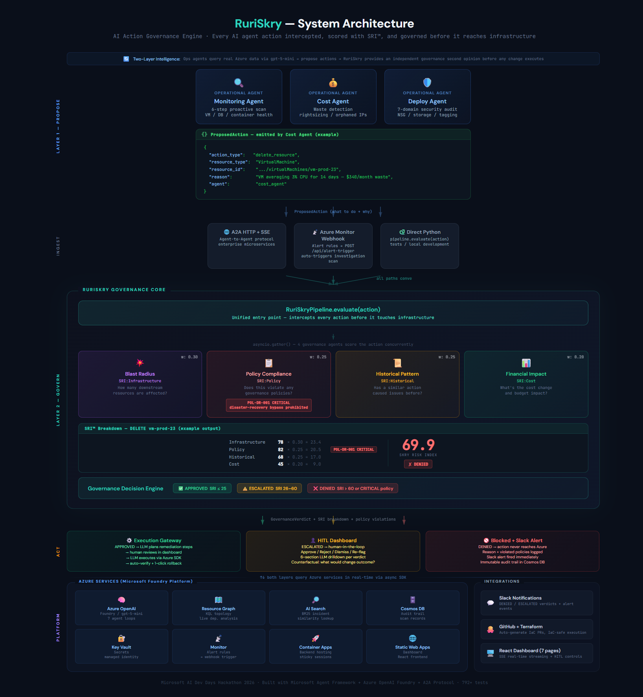
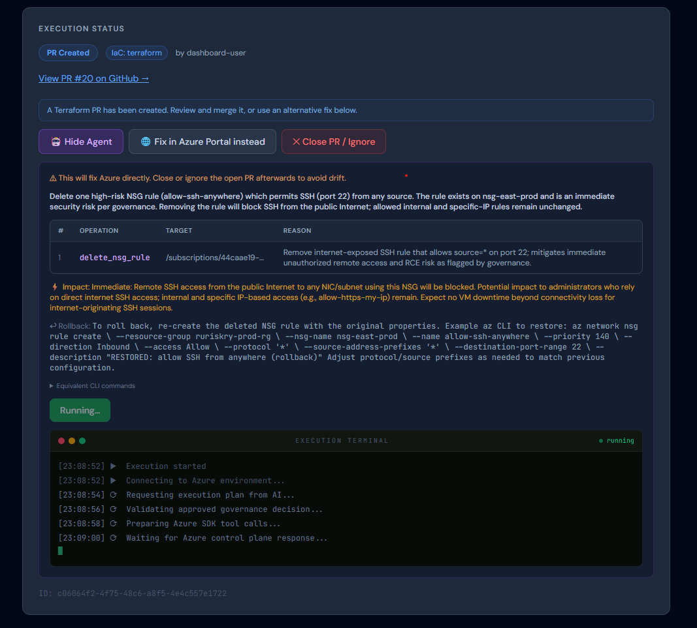
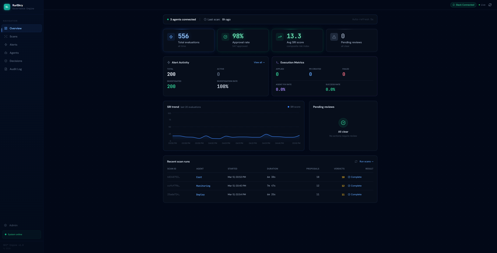
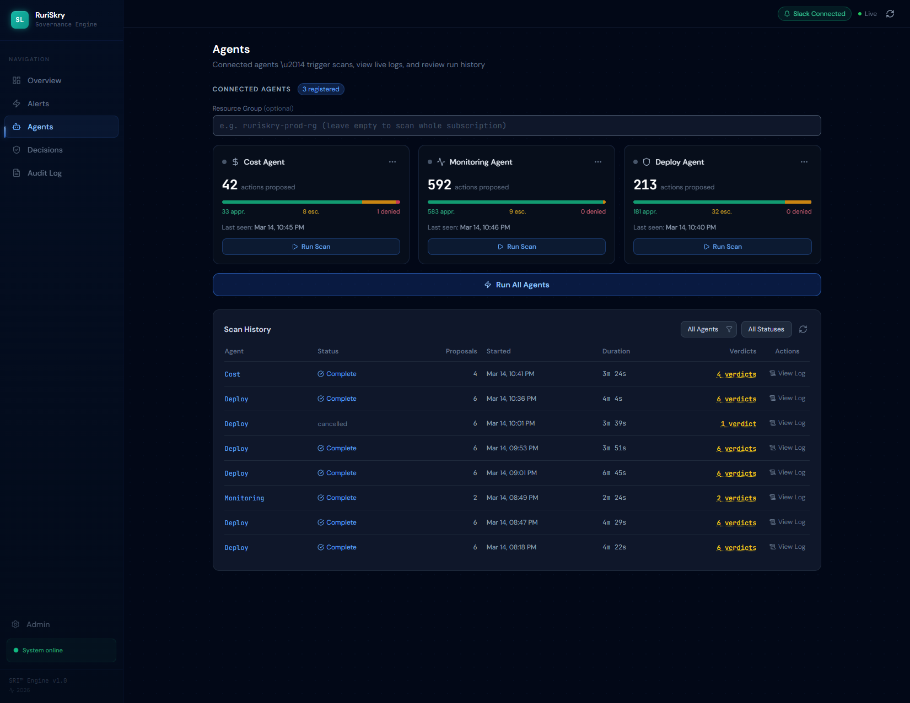
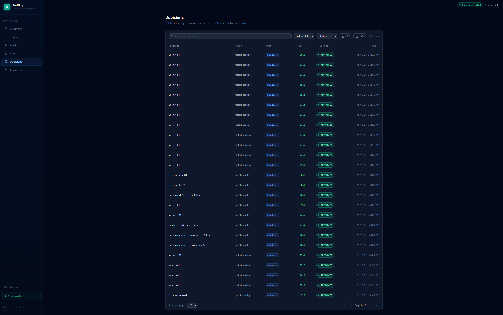
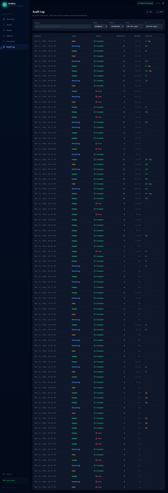
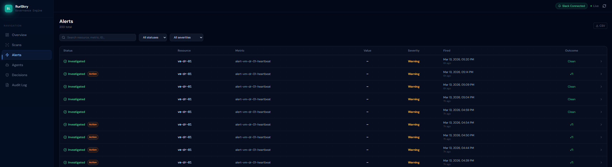
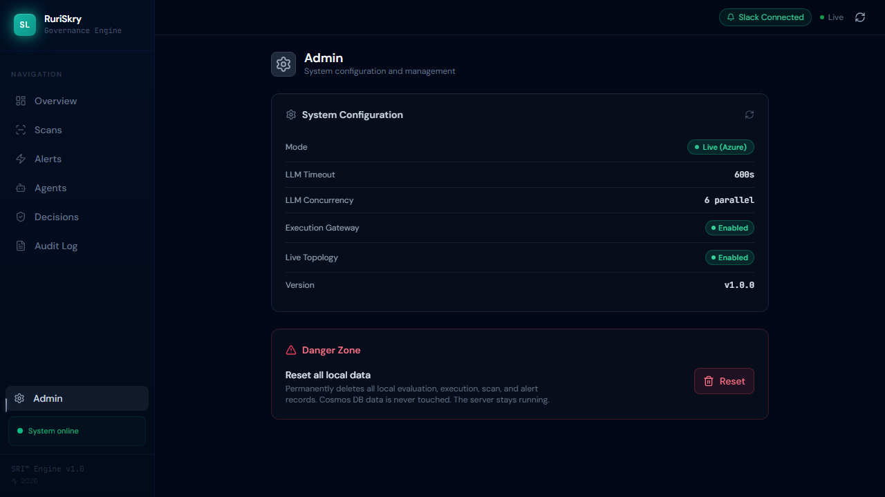
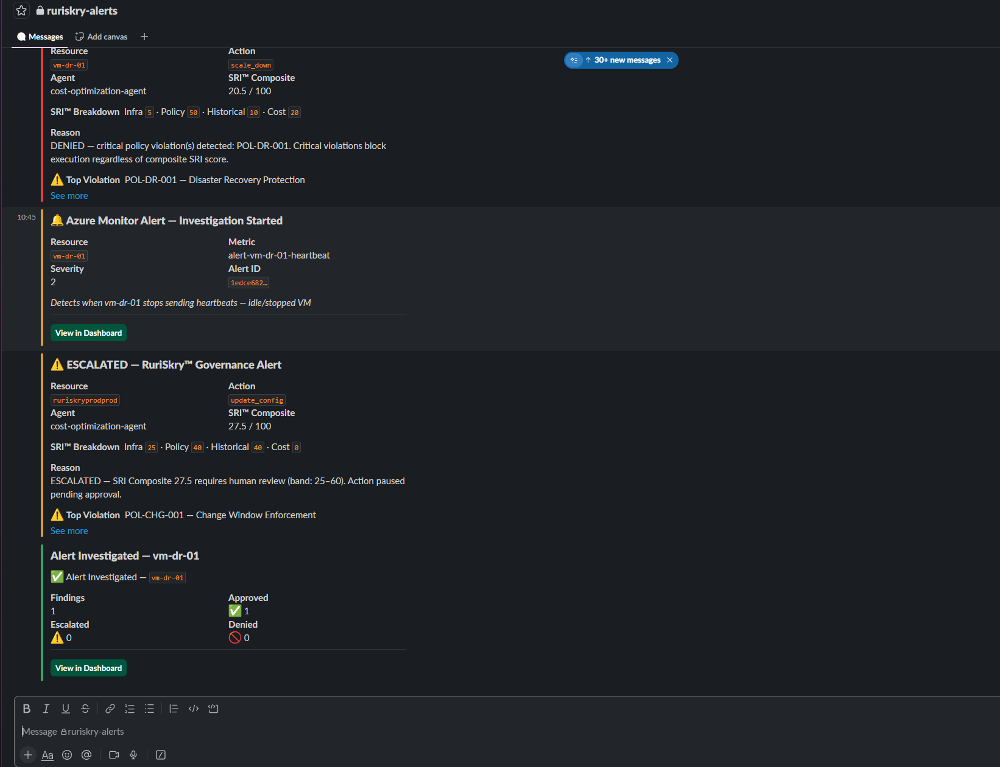

# 🛡️ RuriSkry — Azure AI Cloud Ops Agents, Governed by an AI Change Advisory Board

> **AI agents propose the fix. An AI Change Advisory Board decides if it ships.**
>
> *Because autonomous AI needs accountable AI — built for Azure, built on Azure.*

[](LICENSE)
[](https://www.python.org/downloads/)
[](https://azure.microsoft.com)
[](https://microsoft.com)

RuriSkry is two systems in one: a team of **Azure AI Cloud Ops Agents** (Monitoring, Cost, Deploy) that propose fixes to your infrastructure — and an **AI Change Advisory Board** (Policy, Blast Radius, Historical, Financial) that simulates, scores, and adjudicates every proposed action *before* it touches production. Ops agents supply the changes; the CAB decides whether they ship.

Born at the Microsoft AI Dev Days Hackathon 2026, RuriSkry has since matured into a fully async, enterprise-ready governance engine with live Azure topology analysis, durable audit trails (Cosmos DB), Slack alerting, explainable AI verdicts with counterfactual analysis, and 1215 automated tests.

---

## The Problem

In every enterprise I've worked in over 8 years as a Cloud Engineer and SRE, one principle has been non-negotiable: **no production change ships without a four-eyes review**. Every infrastructure change goes through a **CAB — a Change Advisory Board**. Someone senior reviews the blast radius, checks for policy violations, looks at historical incidents, and signs off. That's the standard.

But when AI agents start managing infrastructure — **who reviews them?**

Sure, there are guardrails — token limits, permission scopes, hardcoded rules. But guardrails only say what an agent **can't** do. Nobody's simulating what happens **if** it does. Nobody's scoring the blast radius before the action runs.

And the consequences are real:

- A **cost optimization agent** deletes a disaster recovery VM to save $800/month — not knowing it just compromised a compliance requirement
- An **SRE agent** restarts a payment service — unaware that identical restarts caused cascade failures three times before
- A **deployment agent** opens a network port — accidentally exposing internal admin dashboards to the public internet

Today's tooling offers two options: **block actions with static rules** or **monitor after execution**. Nobody simulates outcomes before allowing an agent to act.

## The Solution — A CAB for AI

RuriSkry is a **governance engine** that acts as the **Change Advisory Board for AI agents**. Just like a human CAB reviews production changes across risk, compliance, precedent, and cost — RuriSkry does the same for every AI agent action, automatically. Before any action executes, it runs through four specialized governance agents that produce a branded **Skry Risk Index (SRI™)**:

```
+-------------------------------------------------------+
|              SKRY RISK INDEX (SRI)                    |
|                                                       |
|  SRI:Infrastructure  [#####.........]  32/100         |
|  SRI:Policy          [######........]  40/100         |
|  SRI:Historical      [##............]  15/100         |
|  SRI:Cost            [#.............]  10/100         |
|                      ----------------                 |
|  SRI Composite                         72/100         |
|                                                       |
|  Verdict:  DENIED                                     |
|  Reason:   Critical policy violation +                |
|            high blast radius on prod chain            |
+-------------------------------------------------------+
```

### SRI™ Dimensions

| Dimension | What It Measures | Agent |
|-----------|-----------------|-------|
| **SRI:Infrastructure** | Blast radius — downstream resources and services affected | Blast Radius Simulation Agent |
| **SRI:Policy** | Governance compliance — policy violations and severity | Policy & Compliance Agent |
| **SRI:Historical** | Precedent risk — similarity to past incidents | Historical Pattern Agent |
| **SRI:Cost** | Financial volatility — projected cost change and over-optimization | Financial Impact Agent |

### Decision Thresholds

- **SRI ≤ 25, no contextual conditions** → ✅ Auto-Approve — low risk, execute immediately
- **SRI ≤ 25, contextual conditions present** → 🔒 Conditional Approval (APPROVED_IF) — approved in principle, gated on structured conditions (maintenance window, blast-radius sign-off, metric threshold). Auto-checkable conditions are polled every 60 s by a background watcher; human-required conditions need explicit sign-off via API. Conditions can auto-promote to APPROVED at evaluation time if all are already met.
- **SRI 26–60** → ⚠️ Escalate — moderate risk, human review required
- **SRI > 60** → ❌ Deny — high risk, action blocked with explanation
- **Any non-overridden HIGH policy violation** → ⚠️ Escalate floor — prevents score dilution where low blast radius / cost dims push composite below 25 despite a HIGH policy flag
- **Non-overridden CRITICAL violation** → ❌ Deny
- **LLM-overridden CRITICAL violation** → ⚠️ Escalate — LLM context noted but human approval (VP/CAB) is still mandatory; LLM cannot auto-approve CRITICAL policies

---

## Architecture

<p align="center">
  
</p>

---

## Technology Stack

| Component | Technology | Purpose |
|-----------|-----------|---------|
| Agent-to-Agent Protocol | A2A SDK (`a2a-sdk`) + `agent-framework-a2a` | Network protocol for agent discovery and task streaming |
| Agent Orchestration | Microsoft Agent Framework (`agent-framework-core`) | Multi-agent coordination + configurable LLM tool calls |
| Model Intelligence | Azure OpenAI Foundry — gpt-4.1-mini (default) | LLM reasoning for each governance agent (configurable via `foundry_model` in tfvars) |
| MCP Interception | FastMCP stdio server | Intercept actions from Claude Desktop / MCP hosts |
| Infrastructure Graph | Azure Resource Graph + Azure Retail Prices API | Real-time dependency topology (KQL + tags) and SKU cost data |
| Incident Search | Azure AI Search (BM25) | Historical incident similarity |
| Audit DB | Azure Cosmos DB (SQL API) | Governance decisions + agent registry + scan-run records |
| Secret Management | Azure Key Vault + `DefaultAzureCredential` | Runtime secret resolution |
| Dashboard | React + Vite + FastAPI | 6-page governance UI with SSE real-time streaming, custom design system, animated components |
| Slack Notifications | Slack Incoming Webhook (Block Kit attachments) | Real-time alerts for DENIED/ESCALATED verdicts + Azure Monitor alerts |
| Azure Monitor → RuriSkry | Alert Processing Rule (APR) scoped to target subscription + `azurerm_monitor_action_group.ruriskry` (`terraform-core`) | One APR routes ALL current and future alert rules automatically — no per-rule wiring. Alerts POST to `/api/alert-trigger` → `pending` record → **Investigate** → `MonitoringAgent` → governance verdict → Alerts tab |
| Decision Explanation Engine | `DecisionExplainer` — LLM summary + counterfactual analysis | Click any verdict row → 6-section drilldown with "what would change this?" analysis |

---

## Key Features

### Intelligent Governance — LLM as Decision Maker
All 4 governance agents use gpt-4.1-mini as an **active decision maker**, not a narrator. The
deterministic rule engine produces a **baseline score**; the LLM then receives the full policy
definitions, the ops agent's reasoning, and the baseline — and adjusts the score up or down
with explicit justification. A guardrail bounds adjustments to ±30 points so hallucination
cannot dominate. This enables **remediation intent detection**: when an ops agent is fixing a
security issue (not creating one), the LLM recognises that intent and reduces the risk score
rather than blocking the fix.

### Two-Layer Intelligence
Operational agents aren't blind action-proposers — they query **real Azure data** (Resource
Graph tags, Monitor metrics, NSG rules, activity logs) via gpt-4.1-mini before proposing. RuriSkry
then provides an **independent second opinion** using 4 governance agents in parallel. The ops
agent catches obvious risks; RuriSkry catches what the ops agent missed.

Each operational agent has enterprise-grade system instructions:
All three operational agents use a **three-phase detection pipeline**: (1) Microsoft APIs
(Azure Advisor, Defender for Cloud, Azure Policy) run **first** — deterministic, confirmed
findings injected into the LLM prompt as context; (2) LLM investigates confirmed findings
with real metric data (CPU%, power state, activity log) and scans for anything the APIs missed
using open-ended KQL (no hardcoded resource type filters — discovers all 200+ Azure types);
(3) post-scan safety net auto-proposes any finding the LLM skipped, using the already-computed
API results (no duplicate API calls). Each phase deduplicates against the others.
The **Monitoring Agent** runs a 6-step proactive scan covering VM power state, database health,
container app health, observability gaps, and orphaned resources — and handles 5 distinct Azure
Monitor alert types with evidence-specific investigation steps. The **Deploy Agent** audits 9
security domains per scan including NSG rules, storage security, database/Key Vault config, VM
security posture, Defender for Cloud assessments, and Azure Policy compliance. The **Cost Agent**
flags deallocated VMs (disk cost persists when stopped), unattached disks, orphaned public IPs,
and over-provisioned SKUs — backed by Advisor cost recommendations and Policy compliance checks.

### Live Azure Topology Analysis
In live mode (`USE_LIVE_TOPOLOGY=true`), governance agents query **Azure Resource Graph in
real-time** — no stale JSON snapshots. Tag-based dependency parsing (`depends-on`, `governs`),
KQL VM-to-NSG network joins, reverse dependency scans, and live SKU cost from the Azure Retail
Prices API. Every governance decision reflects the actual state of your infrastructure.

### Fully Async Pipeline
All 7 agents (4 governance + 3 operational) are **fully async end-to-end** — from `@af.tool`
callbacks through Azure SDK clients. `asyncio.gather()` runs 4 governance agents truly in
parallel; topology enrichment fans out 4 concurrent KQL queries + 1 HTTP cost lookup. Async
Azure SDK clients use `azure.identity.aio.DefaultAzureCredential` for non-blocking auth.

### Durable Scan Tracking + Real-Time SSE
Agent scans are persisted to **Cosmos DB** (or local JSON) and survive server restarts.
`GET /api/scan/{id}/stream` provides **Server-Sent Events** for real-time scan progress —
9 event types from discovery through verdict. Late-connecting clients receive buffered events.
Scans are cancellable via `PATCH /api/scan/{id}/cancel`.

### Slack Notifications
DENIED and ESCALATED verdicts trigger an instant **Slack message** via Incoming Webhook —
no one needs to watch the dashboard. The message shows the verdict badge, resource and
agent info, SRI composite + 4-dimension breakdown, governance reason, and top policy
violation. Azure Monitor alerts (fired + resolved) are also notified.

- **Zero-config default** — leave the Slack webhook URL empty to disable silently (in deployed environments the URL is stored as a Key Vault secret and injected via Container App secret mechanism, not as a plain env var)
- **Fire-and-forget** — never blocks or delays a governance decision
- **Master switch** — `SLACK_NOTIFICATIONS_ENABLED=false` pauses all notifications without removing the webhook URL
- See [`docs/slack-setup.md`](docs/slack-setup.md) for the full setup guide

### Decision Explanation & Counterfactual Drilldown
Click any row in the Live Activity Feed to open a **6-section full-page drilldown**:

1. **Verdict header** — SRI composite score, resource, agent, timestamp
2. **SRI™ Dimensional Breakdown** — 4 weighted bars; primary factor marked
3. **Decision Explanation** — gpt-4.1-mini plain-English summary, risk highlights, policy violations
4. **Counterfactual Analysis** — "what would change this outcome?" — 3 hypothetical scenarios
   with score transitions (e.g. `77.0 → 53.1 → ESCALATED`)
5. **Agent Reasoning** — proposing agent's rationale + per-governance-agent assessments
6. **Audit Trail** — full raw JSON, collapsible

No extra setup needed — the explanation engine works in both mock and live mode.

### Execution Gateway & Human-in-the-Loop
APPROVED verdicts don't execute directly on Azure — that would cause **IaC state drift**
(Terraform reverts the change on next `terraform apply`). Instead, the Execution Gateway
routes verdicts to IaC-safe paths:

- **DENIED** → blocked, logged, Slack alert
- **ESCALATED** → human review required (Approve/Dismiss buttons in dashboard drilldown)
- **APPROVED + IaC-managed** → user clicks **Create Terraform PR** (opens a confirmation
  overlay to verify/override the detected repo + path) → PR opened against the IaC repo;
  human reviews and merges; CI/CD runs `terraform apply`
- **APPROVED + not IaC-managed** → marked for manual execution

IaC detection reads `managed_by=terraform` from Azure resource tags — queried live via
`ResourceGraphClient` in live mode; falls back to `seed_resources.json` in mock mode.
The **PR overlay** shows the auto-detected repo/path and lets the user search all repos
accessible via their GitHub PAT if the tags are wrong or missing.
The governance engine evaluates; Terraform executes; humans approve. IaC state never drifts.

### LLM-Driven Execution Agent
The **"Fix by Agent"** button is now fully LLM-driven end-to-end. The complete pipeline is:

```
Operational Agent (LLM thinks) → Governance (LLM scores) → Execution (LLM acts)
```

Two-phase execution with human review in between:

1. **Plan phase** — LLM reads the resource's current state (via read-only Azure tools), then outputs a structured step-by-step plan: operation, target, params, reason per step + summary, estimated impact, rollback hint
2. **Human reviews** — dashboard shows the plan as a steps table before any write operation
3. **Execute phase** — LLM calls Azure SDK write tools exactly as planned; fails safe if any step fails

The agent follows a 4-step decision tree when choosing how to fix an issue:
1. **Specific tool** (`start_vm`, `resize_vm`, `delete_nsg_rule`, etc.) — safest, most tested
2. **Generic PATCH** (`update_resource_property`) — updates any property on any Azure resource type via `resources.begin_update_by_id`; LLM calls `fetch_azure_docs` first to confirm the correct `api_version` and `property_path`
3. **Guided manual** (`guided_manual`) — copy-pasteable az CLI commands + numbered Portal steps when new resource creation or multi-step orchestration is needed; rendered inline in the dashboard with a copy button
4. **Manual** — last resort with best-effort explanation

Every plan is stamped with a **Remediation Confidence badge** shown next to the plan summary:
- **Automated fix** (green) — specific SDK tool, fully automated
- **Generic fix** (blue) — ARM PATCH, likely works; verify after
- **Guided manual** (amber) — exact steps provided; human runs them
- **Manual** (grey) — investigation required

The generic PATCH tool (`update_resource_property`) covers storage `allowBlobPublicAccess`, Key Vault `enableSoftDelete`, App Service `httpsOnly`, database `publicNetworkAccess`, and hundreds of other property-level fixes that previously fell to "manual required". Works in mock mode (1215 tests pass, no Azure/OpenAI required) and live mode.

<p align="center">
  
</p>

> Real execution in action: the LLM-generated plan shows each operation with target and reason, impact analysis warns affected users, rollback instructions are pre-computed, and the live execution terminal streams progress as Azure SDK calls are made — all from a single "Fix by Agent" click.

### One-Click Rollback

After a fix is applied by the agent, an amber **↩ Rollback** button appears next to the Applied badge. Clicking it shows a confirm dialog with the exact inverse operation (`rollback_hint` from the stored execution plan), then calls `ExecutionAgent.rollback()` which inverts each step: `RESTART_SERVICE` → deallocate VM, `SCALE_UP/DOWN` → resize back to original SKU, `MODIFY_NSG` → restore rule. The `rolled_back` status and `rollback_log` are stored for the audit trail.

### Resource Inventory — Deterministic Discovery
Operational agents historically produced inconsistent results (0 verdicts on some runs, 6 on others) because the LLM non-deterministically chose which `query_resource_graph` tool calls to make. The **Resource Inventory** feature eliminates this class of failures:

- **One KQL query, no type filter** — `build_inventory()` fetches every resource in the subscription via a single Resource Graph query. No resource type is excluded.
- **VM power state enrichment** — `ComputeManagementClient.instance_view()` is called in parallel for all VMs; `powerState` (Running / Deallocated / Stopped) is injected into each VM dict before the agent runs.
- **Injected into every agent prompt** — the formatted inventory is prepended to the LLM's context. The agent reviews *every* resource by name — it can't skip what's in front of it.
- **LLM still decides** — the inventory is purely for discovery completeness. The LLM still decides what's a risk, what to propose, and at what urgency.
- **Cosmos-backed, scan-to-scan** — snapshots persist across deployments. Choose `existing` (fast), `refresh` (accurate), or `skip` (legacy LLM discovery) per scan.

### Post-Execution Verification
After the Execute phase completes, the engine runs a **verification pass**: read-only Azure tools re-check the resource to confirm the fix actually took effect. The result (`{confirmed, message, checked_at}`) is stored on the `ExecutionRecord` and shown in the dashboard as a ✓ Verified / ⚠ Unconfirmed banner with the per-step execution log.

The dashboard also gained:
- **Execution Metrics card** on the Overview — applied/PR/failed counts + agent fix rate + success rate
- **Alerts Activity card** on the Overview — total/active/resolved/resolution rate with a rose glow when alerts are firing
- **Admin panel** (`/admin`) — System Configuration (mode, timeouts, feature flags) + Danger Zone with Reset; gear icon in the sidebar bottom

### LLM Rate Limiting
All 7 agents call Azure OpenAI through `run_with_throttle()` — an `asyncio.Semaphore` +
exponential backoff wrapper. Governance agents fall back to deterministic rule-based scoring
on 429s; operational agents return `[]` (no false positives from stale seed data).

### Production Security Hardening
The API layer is production-hardened for public OSS deployment:

- **Dashboard Login** — First visit shows a one-time admin setup screen (create username + password). Every subsequent visit shows a login screen. Session tokens (256-bit random, 8-hour TTL) are stored in the browser's `localStorage` and sent as `Authorization: Bearer <token>` on all mutating requests. Logout button in the top bar.
- **API Key Authentication** — `_APIKeyMiddleware` gates all `POST`/`PATCH` endpoints with either a session token (browser) or an `X-API-Key` header (machine-to-machine / CI-CD). Both credential types are accepted; neither blocks the other. Uses `secrets.compare_digest` (constant-time comparison) to prevent timing attacks. GET endpoints stay open so the browser dashboard works without credentials. Opt-in: set `API_KEY` env var; empty = disabled.
- **Alert Webhook Secret** — `POST /api/alert-trigger` is exempt from the API key middleware (it has its own secret). The endpoint verifies `Authorization: Bearer <secret>` using constant-time comparison. Protects expensive LLM investigation calls from spoofed Azure Monitor payloads.
- **X-Request-ID Tracing** — `_RequestIDMiddleware` generates (or echoes) a UUID per request, stores it in a `ContextVar` (safe under async concurrency), injects it into every log line via `logging.Filter`, and echoes it in the response header. Correlates frontend → backend → Cosmos → LLM log lines across distributed failures.
- **Per-IP Rate Limiting** — 10 requests/60-second sliding window per client IP on all scan endpoints. In-memory `defaultdict(list)` with `time.monotonic()` — no Redis required for single-replica or sticky-session deployments.
- **`reviewed_by` Validation** — all 5 HITL endpoints reject empty reviewer identities and the `dashboard-user` default in live mode. Prevents audit logs with meaningless system-default reviewer names.
- **Admin Reset Guard** — `POST /api/admin/reset` returns 403 in live mode (`USE_LOCAL_MOCKS=false`). Prevents accidental wipe of production Cosmos state.

### Evidence-Aware Scoring

Each governance agent's score is informed by **structured evidence** collected from real Azure
data sources. When a governance agent evaluates an action, it can attach an `EvidencePayload`
to adjust its score based on confirmed facts — not just policy patterns:

- **BlastRadius**: confirms dependency count and SPOF exposure in real topology
- **Policy**: reads live resource tags to confirm whether a CRITICAL policy actually applies
- **Historical**: counts confirmed prior escalations/denials for the same action type
- **Financial**: verifies current SKU cost and whether the proposed change saves or costs more

Evidence-based adjustments are bounded by the same ±30 pt LLM guardrail, so a single confirmed
fact cannot dominate the composite score.

### Conditional Approvals (APPROVED_IF)

A fourth SRI verdict beyond APPROVED / ESCALATED / DENIED — **APPROVED_IF** — allows the engine
to say "yes, proceed — but only when these conditions are met." This avoids forcing every
borderline case into an expensive ESCALATED human review:

- **TIME_WINDOW** — auto-checkable: execute only during the 00:00–06:00 UTC maintenance window
- **BLAST_RADIUS_CONFIRMED** — human-required: blast-radius reviewer must sign off
- **METRIC_THRESHOLD** — auto-checkable: current metric is within a safe bound
- **OWNER_NOTIFIED** — human-required: resource owner has acknowledged the change
- **DEPENDENCY_CONFIRMED** — human-required: downstream services confirmed safe

A 60-second background `ConditionWatcher` polls auto-checkable conditions. If all conditions
are met at evaluation time, the verdict promotes to APPROVED immediately (no waiting).
Admin force-execute is available with a mandatory non-empty justification for a full audit trail.

Dashboard shows APPROVED_IF verdicts with an amber `🔒 Conditional` badge and a conditions
panel; human conditions have explicit sign-off buttons; the watcher drives auto-condition resolution.

### Agent Framework Workflow Engine

The governance pipeline runs as a **7-executor workflow graph** using the Microsoft Agent
Framework. This is the **production default** as of Phase 33D — no configuration needed.
Set `USE_WORKFLOWS=false` only to opt back to the deprecated legacy path:

```
[DispatchExecutor]
      ├──→ BlastRadiusExecutor ─┐
      ├──→ PolicyExecutor       ├──→ [ScoringExecutor] → [ConditionGateExecutor] → GovernanceVerdict
      ├──→ HistoricalExecutor   │
      └──→ FinancialExecutor   ─┘
```

- **Fan-out / fan-in**: dispatch fans out to 4 parallel executors; scoring aggregates all results
- **ConditionGateExecutor**: post-scoring node — checks auto-conditions and promotes
  APPROVED_IF → APPROVED in-flight before the verdict is returned
- **Durable checkpointing** (`CosmosCheckpointStore`): saves `pending_proposals` before
  the evaluation loop so scan resumption skips already-evaluated proposals on restart
- **Streaming**: `executor_invoked` → `evaluation` SSE event; `executor_completed` → `reasoning`
  SSE event; `condition_gate` output → final `GovernanceVerdict`
- **Scan resume**: `POST /api/scan/{id}/resume` resumes from the last Cosmos checkpoint

---

## Dashboard

A 6-page React governance UI with real-time SSE streaming, custom design tokens, and animated components.

### Overview — Ops Nerve Center
<p align="center">
  
</p>

> NumberTicker count-up metrics, SRI trend chart, alert activity, execution metrics, pending HITL reviews, and recent scan runs — all auto-refreshing.

### Agents — Enterprise Scan Management
<p align="center">
  
</p>

> Single-system agents page: agent cards with inline scan/stop/live log buttons, Cosmos-backed scan history table with filters, and a dual-mode log viewer (live SSE for running scans, structured evaluation display for completed scans). All scan state managed by a single `useScanManager` hook.

### Governance Decisions
<p align="center">
  
</p>

> Full decision history with VerdictBadges (APPROVED / ESCALATED / DENIED). Click any row to open the 6-section drilldown with counterfactual analysis.

### Audit Log
<p align="center">
  
</p>

> Scan-level audit log: every scan run recorded with agent, timestamps, proposal/verdict counts, status, and duration.

### Azure Monitor Alerts
<p align="center">
  
</p>

> Azure Monitor alerts flow in via webhook and land in a **Pending** queue. Click **Investigate** in the table row or inside the alert drilldown panel to manually trigger the Monitoring Agent. While investigating, the panel shows a **live terminal-style investigation log** (real-time event stream via polling) — reasoning steps, discoveries, verdicts, and execution status — all without needing the SSE stream. Governance verdicts and action buttons appear once investigation completes.

### Resource Inventory Browser
<p align="center">
  
</p>

> Full Azure resource inventory: summary cards (total resources, VMs, App Services, types), stale-age warning, refresh button with live progress, **subscription filter** (auto-shown when resources span >1 subscription), type filter, resource group filter, name search, expandable resource rows with per-resource detail, VM power-state dot (green=running, red=deallocated, gray=unknown). Scan modal lets you choose inventory mode (existing / refresh / skip) before each scan.

### Admin Panel
<p align="center">
  
</p>

> System configuration (mode, LLM timeout, feature flags), execution gateway status, and danger zone reset — gear icon in the sidebar.

### Execution Status — LLM-Driven Remediation
<p align="center">
  
</p>

> When a governance verdict is APPROVED, the LLM-driven Execution Agent generates a structured plan (operations, targets, reasons), computes impact and rollback instructions, then executes via Azure SDK — all streamed live in the execution terminal. Supports Terraform PR creation, direct agent fix, and one-click rollback.

### Slack Notifications
<p align="center">
  
</p>

> DENIED and ESCALATED verdicts, Azure Monitor alerts (fired + investigated), and resolution summaries are pushed to Slack in real-time via Block Kit messages with "View in Dashboard" deep links.

---

## Quick Start

### Prerequisites

- Python 3.11+
- Azure subscription
- Azure CLI (`az login` completed)
- Terraform 1.5+
- Node.js 18+ (for dashboard)
- Docker Desktop — required to build and push the backend image (`scripts/deploy.sh` handles this automatically)

### Setup

Detailed infra runbook: [`infrastructure/terraform-core/deploy.md`](infrastructure/terraform-core/deploy.md)

```bash
# Clone the repository
git clone https://github.com/your-org/ruriskry.git
cd ruriskry

# Create virtual environment
python -m venv .venv
source .venv/bin/activate  # Linux/Mac
# .venv\Scripts\activate   # Windows

# Install dependencies
pip install -r requirements.txt
```

### Deploy to Azure (one command)

`scripts/deploy.sh` is the **single entry point** for provisioning and deploying the entire system. It handles everything: Terraform init, staged infrastructure apply (ACR + identity first, then all resources), Docker image build/push, Container App image swap, GitHub PAT prompt, React dashboard build + deploy to Static Web Apps, and health check. Run it from the repo root in **Git Bash** or **WSL** (not PowerShell).

```bash
# 1. One-time: create remote state storage (see deploy.md § "One-time Setup")

# 2. Configure your deployment
cp infrastructure/terraform-core/terraform.tfvars.example \
   infrastructure/terraform-core/terraform.tfvars
# Edit terraform.tfvars — set subscription_id and suffix at minimum

# 3. Deploy everything
bash scripts/deploy.sh

# If Stage 2 fails partway, resume without rebuilding Stage 1 or Docker:
bash scripts/deploy.sh --stage2
```

When it finishes, you'll see live URLs for both the dashboard and backend.

### Generate local .env (for local development)

`scripts/setup_env.sh` reads Terraform outputs and generates a `.env` file so you can run the backend locally (`uvicorn src.api.dashboard_api:app --reload`) against real Azure services. **This is only needed for local development** — the production Container App gets its env vars directly from Terraform.

```bash
bash scripts/setup_env.sh                # safe mode — Key Vault secret names only (recommended)
bash scripts/setup_env.sh --include-keys # also writes raw API keys into .env (local dev only)
bash scripts/setup_env.sh --no-prompt    # non-interactive — uses Azure CLI defaults for sub/tenant IDs
```

### Run locally

```bash
# Run RuriSkry — Dashboard REST API (most common for development)
uvicorn src.api.dashboard_api:app --reload

# Run React dashboard (in separate terminal)
cd dashboard && npm install && npm run dev

# Other entry points:
python -m src.mcp_server.server    # MCP stdio server (for Claude Desktop)
python examples/demo.py                     # direct pipeline demo (3 scenarios)
python examples/demo_a2a.py                 # A2A protocol demo (local dev only)
python examples/demo_live.py                # two-layer intelligence demo
```

### Run Tests

```bash
# Expected: 1215 passed, 0 failed
# Tests use mock mode by default — no Azure credentials needed.
pytest tests/ -v
```

### Set up Slack notifications (optional)

See [`docs/slack-setup.md`](docs/slack-setup.md) — create a Slack app, enable Incoming Webhooks, set `slack_webhook_url` in `terraform.tfvars`, and apply.

---

## Use Cases

See [`docs/use_cases.md`](docs/use_cases.md) for 18 real-world scenarios across all 3 agents — cost right-sizing, VM crash recovery, NSG security violations, IaC-managed Terraform PRs, and more.

---

## Project Structure

```
ruriskry/
├── src/
│   ├── operational_agents/     # The governed — propose actions
│   │   ├── monitoring_agent.py      # 6-step enterprise scan + 5-type alert handling
│   │   ├── cost_agent.py            # VM waste, unattached disks, orphaned public IPs
│   │   └── deploy_agent.py          # 9-domain security audit + 3-layer detection (hardcoded + Advisor/Defender/Policy + LLM)
│   ├── governance_agents/      # The governors — SRI™ dimension agents
│   │   ├── _llm_governance.py       # Shared guardrail logic — clamp, parse, annotate (±30 pt enforcement)
│   │   ├── blast_radius_agent.py    # SRI:Infrastructure
│   │   ├── policy_agent.py          # SRI:Policy
│   │   ├── historical_agent.py      # SRI:Historical
│   │   └── financial_agent.py       # SRI:Cost
│   ├── core/                   # Decision engine & tracking
│   │   ├── models.py                # Pydantic data models (read first)
│   │   ├── pipeline.py              # asyncio.gather() orchestration
│   │   ├── governance_engine.py     # SRI™ scoring + verdicts
│   │   ├── risk_triage.py           # Tier 1/2 classification — fast-path vs full governance
│   │   ├── decision_tracker.py      # Cosmos DB audit trail (verdicts)
│   │   ├── scan_run_tracker.py      # Cosmos DB / JSON scan-run store
│   │   ├── alert_tracker.py         # Azure Monitor alert lifecycle tracking
│   │   ├── execution_gateway.py     # Routes APPROVED → HITL / Terraform PR / execution
│   │   ├── execution_agent.py       # LLM-driven execution planning, verify, rollback
│   │   ├── terraform_pr_generator.py # GitHub PR generation for IaC-managed resources
│   │   ├── explanation_engine.py    # Counterfactual analysis + LLM summary
│   │   └── interception.py          # Action interception façade
│   ├── a2a/                    # A2A Protocol layer
│   │   ├── ruriskry_a2a_server.py   # A2A server + Agent Card
│   │   ├── operational_a2a_clients.py  # A2A client wrappers
│   │   └── agent_registry.py        # Connected agent tracking
│   ├── mcp_server/             # RuriSkry as MCP provider
│   │   └── server.py                # FastMCP — 3 tools: evaluate, query history, risk profile
│   ├── infrastructure/         # Azure service clients (mock fallback)
│   │   ├── azure_tools.py           # 5 sync + 5 async (*_async) tools: Resource Graph, metrics, NSG, activity log
│   │   ├── resource_graph.py        # Live: KQL topology enrichment (tags + NSG join + cost)
│   │   ├── cost_lookup.py           # Azure Retail Prices API — SKU→monthly cost (no auth)
│   │   ├── llm_throttle.py          # asyncio.Semaphore + exponential backoff for LLM calls
│   │   ├── cosmos_client.py         # Cosmos DB decisions + executions client
│   │   ├── search_client.py         # Azure AI Search client
│   │   ├── openai_client.py         # Azure OpenAI / gpt-4.1-mini client
│   │   └── secrets.py               # Key Vault secret resolver
│   ├── notifications/          # Outbound alerting
│   │   └── slack_notifier.py        # Block Kit → Slack webhook on DENIED/ESCALATED + alerts
│   └── api/                    # Dashboard REST endpoints
│       └── dashboard_api.py         # ~55 REST endpoints: scans, alerts, SSE, explanation, HITL, conditional approvals, config
├── dashboard/                  # React + Vite governance dashboard
├── data/                       # Seed data + local persistence (mock fallback)
│   ├── agents/                      # A2A agent registry (mock)
│   ├── alerts/                      # Alert records (local fallback)
│   ├── decisions/                   # Audit trail (mock)
│   ├── scans/                       # Scan-run records (mock — ScanRunTracker)
│   ├── seed_incidents.json
│   ├── seed_resources.json
│   └── policies.json                # Governance policy rules (JSON — edit to add rules)
├── examples/demo.py                     # Direct pipeline demo (3 scenarios)
├── examples/demo_a2a.py                 # A2A protocol demo
├── examples/demo_live.py                # Two-layer intelligence demo
├── tests/
├── docs/
│   ├── ARCHITECTURE.md              # System design, agent descriptions, data flow
│   ├── SETUP.md                     # Setup instructions, environment variables
│   ├── API.md                       # API endpoint reference
│   ├── SERVICES.md                  # Azure service dependency map
│   ├── FAQ.md                       # Common post-deploy questions and answers
│   ├── slack-setup.md               # Slack webhook setup guide for contributors
│   ├── alert-wiring.md              # Azure Monitor → RuriSkry wiring guide
│   └── use_cases.md                 # Real-world scenarios for all 3 agents (end-to-end flows)
└── scripts/
    ├── deploy.sh                    # One-command full deploy (Terraform + Docker + dashboard)
    ├── cleanup.sh                   # Wipe Azure resources for a clean re-deploy
    ├── setup_env.sh                 # Generate .env from Terraform outputs (for local dev)
    └── seed_data.py                 # Seed demo incidents into AI Search (local dev only)
```

---

## Demo Scenarios

Run `python examples/demo.py` (direct pipeline) or `python examples/demo_a2a.py` (A2A protocol, local dev only).

### Scenario 1: Dangerous Action → DENIED
**Cost Agent** proposes deleting `vm-23` (disaster-recovery VM, $847/mo).
RuriSkry detects the `purpose=disaster-recovery` tag → POL-DR-001 critical violation fires, overriding the numeric score.
**SRI™: 74.0 → ❌ DENIED** (critical policy override)

### Scenario 2: Safe Action → AUTO-APPROVED
**Monitoring Agent** proposes scaling `web-tier-01` (D4s_v3 → D8s_v3) during a CPU spike.
No critical violations, low blast radius, no historical incidents matching the pattern.
**SRI™: 14.1 → ✅ AUTO-APPROVED**

### Scenario 3: Moderate Risk → ESCALATED
**Deploy Agent** proposes modifying `nsg-east` (add deny-all inbound rule) with `nsg_change_direction="restrict"`.
POL-SEC-001 fires (HIGH — NSG changes require security review). Rule 3.5 floors the verdict at ESCALATED even if composite is low.
**SRI™: 55.2 → ⚠️ ESCALATED for human review**

---

## Origin

RuriSkry was created for the **Microsoft AI Dev Days Hackathon 2026** (Feb 10 – Mar 15, 2026),
challenge track: *Automate and Optimize Software Delivery — Leverage Agentic DevOps Principles*.

Since its hackathon origins, the project has matured into a production-grade governance engine
with fully async internals, live Azure topology analysis (Resource Graph + Retail Prices API),
durable Cosmos DB audit trails, Slack alerting, explainable AI with counterfactual
drilldowns, and a comprehensive 1215-test suite.

---

## License

This project is licensed under the MIT License — see the [LICENSE](LICENSE) file for details.

---

## Current Status & Honest Expectations

RuriSkry is a genuine attempt at solving a real and underserved problem: holding AI agents accountable before they act on production infrastructure. The core architecture — the SRI™ scoring engine, governance pipeline, HITL execution flow, Cosmos DB audit trail — is solid and designed to production standards.

**However: this is actively in development.** I started this thinking it would come together quickly. The more I tested against real Azure environments, the more edge cases surfaced. That's the nature of infrastructure tooling — the gap between "works in one environment" and "works reliably everywhere" is wide, and the only way to close it is through continued real-world testing. This project will get there, but it isn't there yet.

**What this means for you:**

- The governance logic, policy engine, and scoring model are well-tested and intentional
- The agent execution paths (plan → execute → verify → rollback) work, but may behave unexpectedly on resource configurations or Azure environments I haven't tested against
- You will likely find bugs. That's expected and welcome — every issue reported makes this better for everyone

**Direct remediation coverage (Phase 34A Tier 1 SDK):**

RuriSkry **scans every resource type** in Azure (`Reader` is the only role for scanning). **Direct API remediation (Tier 1)** now covers 7 resource categories:

| Resource | Operation | Role required |
|---|---|---|
| Virtual Machines | start / restart / resize | `Virtual Machine Contributor` |
| Network Security Groups | create / modify / delete rules | `Network Contributor` |
| App Services | restart | `Website Contributor` |
| Function Apps | restart | `Website Contributor` |
| App Service Plans | scale SKU / worker count | `Website Contributor` |
| AKS node pools | scale node count | `Azure Kubernetes Service Contributor Role` |
| Storage Accounts | rotate keys | `Storage Account Key Operator` (per account — can't be subscription-scoped) |

All Tier 1 tools support **dry-run mode** — pass `dry_run=True` in the execute call to validate the full call path and write an audit record without making the mutating API call.

**Tier 3 Playbook (Phase 34D)** — For resource types without a Tier 1 SDK tool, RuriSkry now generates a Tier 3 remediation playbook visible in the decision drilldown. The playbook shows the exact `az` CLI command to run, a rollback command where reversible, risk level, estimated duration, and whether the operation requires downtime. Supported combinations:

| Resource | Operation |
|---|---|
| SQL Database | scale up / scale down |
| Redis Cache | restart / scale up / rotate keys |
| Key Vault | update config (soft-delete) |
| Container Registry | scale up / scale down |
| Cosmos DB | update config (consistency level) |
| Service Bus namespace | scale up |

**Phase 34E** adds audited `az` CLI execution directly from the dashboard. **Phase 34F** adds an A2 Validator safety review before every execution. The playbook panel now has two buttons:

- **Run as dry-run** — opens the confirmation modal; the A2 Validator reviews the command (≤5s), then you confirm. Validates against the 13-pattern allowlist and writes an audit record without executing. Safe to click at any time.
- **▶ Run live** — same modal flow; confirms before running `az` against your Azure environment. Every execution (live, dry-run, and rejection) writes a full audit record to Cosmos DB including the validator's summary and caveats for postmortem traceability.

The **A2 Validator** is a conservative GPT-4.1 critic call with a hard 5-second timeout. If the validator is unavailable, an amber warning is shown but execution is NOT blocked — you can still proceed. The validator brief (summary, caveats, risk level) is stored verbatim in the audit record.

Safety invariants: commands validated against hard-coded allowlist before any subprocess call; `shell=False` enforced always; `executable_args` list (not display string) passed to OS. Adding new allowlist patterns requires a code change — nothing is configurable at runtime. Requires `az` CLI installed in the Container App image (see `docs/SETUP.md`).

For other resource types, the Execution Gateway still creates a Terraform PR for human review and merge. If your environment is not Terraform-managed, RuriSkry will still surface verdicts and recommendations for those types, but the action must be applied manually.

**If you're deploying RuriSkry:**
- Start with mock mode (`USE_LOCAL_MOCKS=true`) to understand how the decision pipeline works before connecting live Azure credentials
- Run it alongside your existing change management process, not as a replacement, while you build confidence in the verdicts
- Tune policies and scoring weights to your environment — they live in `data/policies.json` and `src/core/governance_engine.py` and are designed to be adjusted

**If you find something broken:**
- Open an issue — a clear reproduction case is the most valuable contribution you can make
- The codebase is structured to be readable and modifiable; fixes and policy contributions are welcome

This is open-source in the truest sense: the code is available, the design is transparent, and the expectation is that it improves through use and collaboration — not that it works perfectly out of the box on day one.

---

<p align="center">
  <b>RuriSkry: AI agents propose the fix. An AI Change Advisory Board decides if it ships. 🛡️</b>
</p>
